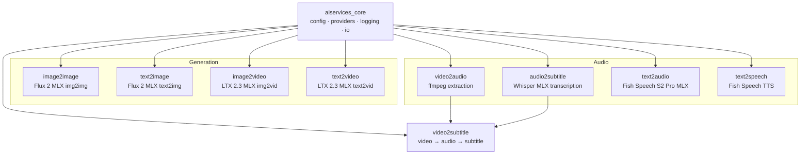

# AIServices

A monorepo of 8 AI/ML media processing modules built for Apple Silicon. Uses [MLX](https://github.com/ml-explore/mlx) for local GPU inference, with a provider pattern that supports cloud backends (ComfyUI, Replicate).

## Architecture



## Quick Start

```bash
# Clone and install
git clone https://github.com/<org>/AIServices.git
cd AIServices
uv sync --all-packages

# Run tests
uv run pytest

# Run a module
uv run text2image generate --prompt "a sunset over mountains" --output sunset.png
```

### Requirements

- Python 3.11+
- Apple Silicon (M1/M2/M3/M4) for MLX providers
- FFmpeg (for video2audio, video2subtitle)

## Modules

| Module | Description | Install | CLI |
|--------|-------------|---------|-----|
| [image2image](packages/image2image/README.md) | Flux 2 MLX image-to-image editing | `uv tool install ./packages/image2image` | `image2image` |
| [text2image](packages/text2image/README.md) | Flux 2 MLX text-to-image generation | `uv tool install ./packages/text2image` | `text2image` |
| [image2video](packages/image2video/README.md) | LTX 2.3 MLX image-to-video | `uv tool install ./packages/image2video` | `image2video` |
| [text2video](packages/text2video/README.md) | LTX 2.3 MLX text-to-video | `uv tool install ./packages/text2video` | `text2video` |
| [video2audio](packages/video2audio/README.md) | FFmpeg audio extraction from video | `uv tool install ./packages/video2audio` | `video2audio` |
| [audio2subtitle](packages/audio2subtitle/README.md) | Whisper MLX audio transcription to SRT/VTT | `uv tool install ./packages/audio2subtitle` | `audio2subtitle` |
| [text2audio](packages/text2audio/README.md) | Fish Speech S2 Pro MLX audio generation | `uv tool install ./packages/text2audio` | `text2audio` |
| [text2speech](packages/text2speech/README.md) | Fish Speech text-to-speech synthesis | `uv tool install ./packages/text2speech` | `text2speech` |
| [video2subtitle](packages/video2subtitle/README.md) | Pipeline: video → audio → subtitle | `uv tool install ./packages/video2subtitle` | `video2subtitle` |

### Supporting Packages

| Package | Description |
|---------|-------------|
| `aiservices-core` | Shared config, provider registry, logging, IO utilities |
| `subtitle-translate` | SRT/VTT translation between languages |
| `subtitle-filter` | SRT/VTT subtitle filtering and cleanup |

## Examples

See the [examples/](examples/) directory for runnable Python API examples:

```bash
uv run python examples/text2image_example.py
uv run python examples/image2image_example.py
uv run python examples/image2video_example.py
# ... one per module
```

## Development

```bash
uv sync --all-packages          # install all packages
uvx ruff check                  # lint
uvx ruff format                 # format
uvx pyright                     # type check
uv run pytest                   # run tests
uv run pytest --cov             # tests with coverage
```

All packages follow the same layout: `packages/<name>/src/<package_name>/` with a `cli.py` entry point registered in `pyproject.toml`.

### Provider Pattern

Each module uses a provider registry from `aiservices-core`. Providers are selected by name:

```python
from image2image.providers import registry
provider = registry.get("image2image.mlx")  # local MLX
# provider = registry.get("image2image.comfyui")  # ComfyUI API
```

## Changelog

See [CHANGELOG.md](CHANGELOG.md) for release history.

## License

See [LICENSE](LICENSE) for details.
